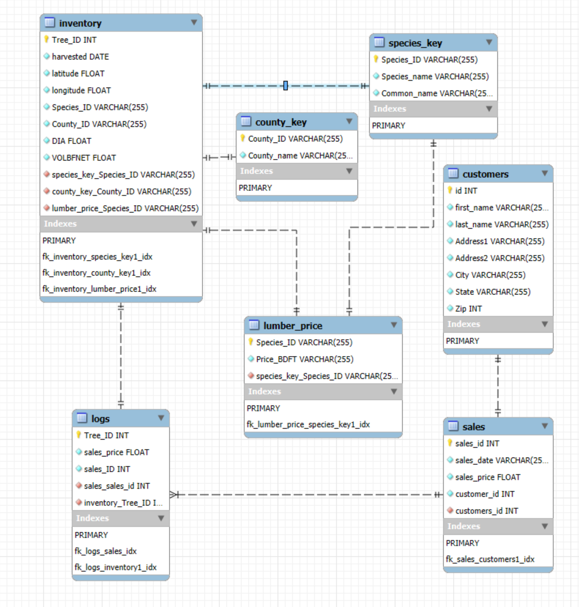

# Arborist Elite of Garden State Manor
**New Jersey's Premier Log Cabin Suppliers**

###  A fictional company created to demonstrate knowledge of comprehensive database systems. This project showcases implementation and demonstration of how a database can be used for analysis by collecting, storing, and retrieving data.

### Where is the data from?
Data is collected from iNaturalist, USDA FIA Datamart, randomly generated data from Mockaroo, and the creative minds of Michael Flanagan and Andrew Morales

### How was it collected?
Data is crowdsourced by iNaturalist users making observations in the wild. These observations are reviewed within the community to verify findings and ensure quality standards. Verified observations are labeled as "Research-Grade" and can be used for scientific research. Data from the USDA is collected by employees making field observations of inventoried trees.

### What program was used to clean the data?
R was used to create the "inventory" for Arborist_Elite. Data from both iNaturalist and the USDA were manipulated and combined into a single master dataset
Python was used to create the database within MySQL Workbench
MySQL Workbench was used to generate the schema for the Arborist Elite database and run queries

## Database Schema Overview

### Table: `inventory`
| Column Name   | Data Type     | Description                            |
|---------------|---------------|----------------------------------------|
| `Tree_ID`     | Integer       | Unique identifier for each tree.       |
| `harvested`   | Date          | Date the tree was harvested (YYYY-MM-DD|
| `latitude`    | Decimal       | Latitude coordinates of the tree.      |
| `longitude`   | Decimal       | Longitude coordinates of the tree.     |
| `Species_ID`  | String        | Identifier linking to the `species_key` table. |
| `County_ID`   | String        | Identifier linking to the `county_key` table.  |
| `DIA`         | Decimal       | Diameter of the tree in inches.                  |
| `VOLBFNET`    | Decimal       | Net volume in board feet.              |

### Table: `customers`
| Column Name   | Data Type     | Description                            |
|---------------|---------------|----------------------------------------|
| `id`          | Integer       | Unique identifier for each customer.   |
| `first_name`  | String        | First name of the customer.            |
| `last_name`   | String        | Last name of the customer.             |
| `Address1`    | String        | Primary address of the customer.       |
| `Address2`    | String (NULL) | Secondary address (optional).          |
| `City`        | String        | City of the customer.                  |
| `State`       | String        | State of the customer.                 |
| `Zip`         | String        | ZIP code of the customer's address.    |

### Table: `sales`
| Column Name   | Data Type     | Description                              |
|---------------|---------------|------------------------------------------|
| `sales_id`    | Integer       | Unique identifier for each sale.         |
| `sales_date`  | Date          | Date of the sale (MM/DD/YYYY)            |
| `sales_price` | Decimal       | Total price of the sale.                 |
| `customer_id` | Integer       | Identifier linking to the `customers` table. |

### Table: `lumber_price`
| Column Name   | Data Type     | Description                            |
|---------------|---------------|----------------------------------------|
| `Species_ID`  | String        | Identifier linking to the `species_key` table. |
| `Price_BDFT`  | Decimal       | Price per board foot for the species.  |

### Table: `species_key`
| Column Name   | Data Type     | Description                            |
|---------------|---------------|----------------------------------------|
| `Species_ID`  | String        | Unique identifier for species.         |
| `Species_name`| String        | Scientific name of the species.        |
| `Common_name` | String        | Common name of the species.            |

### Table: `county_key`
| Column Name   | Data Type     | Description                            |
|---------------|---------------|----------------------------------------|
| `County_ID`   | String        | Unique identifier for the county.      |
| `County_name` | String        | Name of the county.                    |

### Table: `logs`
| Column Name   | Data Type     | Description                            |
|---------------|---------------|----------------------------------------|
| `Tree_ID`     | Integer       | Identifier for the tree in `inventory`.|
| `sales_price` | Decimal       | Price for the tree when sold.          |
| `sales_ID`    | Integer       | Identifier linking to the `sales` table.|
## Regulations to Using the Data
[Terms of use](https://www.inaturalist.org/pages/terms) for the iNaturalist website and accompanying data  

[USDA Regulations & Directives] (https://www.fs.usda.gov/about-agency/regulations-policies)
